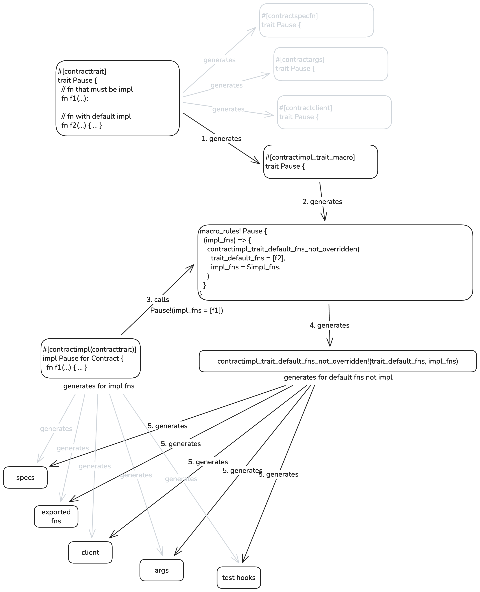

# `#[contracttrait]` Macro Internals

This document describes how the `#[contracttrait]` macro works internally. It is intended for SDK developers who need to understand or modify the macro implementation.

## Overview

The `#[contracttrait]` macro enables defining reusable contract interfaces as Rust traits. When a contract implements such a trait with `#[contractimpl(contracttrait)]`, the macro system generates all the necessary machinery: specs, exported functions, client methods, args variants, and test hooks.

The key challenge is handling **default trait functions**. When a trait has functions with default implementations, those defaults should be exported unless the contract explicitly overrides them. This requires a multi-stage macro expansion because proc macros cannot see which trait functions are not being overridden at the time they process the trait definition.

## Diagram



## Stage-by-Stage Breakdown

### Stage 1: `#[contracttrait]` generates helper attributes

**Source:** `soroban-sdk-macros/src/derive_trait.rs`

When `#[contracttrait]` is applied to a trait, it wraps the trait with four additional attributes:

```rust
#[contractspecfn(name = "PauseSpec", export = false)]
#[contractargs(name = "PauseArgs")]
#[contractclient(crate_path = soroban_sdk, name = "PauseClient")]
#[contractimpl_trait_macro(crate_path = soroban_sdk)]
trait Pause { ... }
```

Each attribute processes the trait and passes it through to the next, and generates code for a specific purpose.

The rest of this document focuses on the behavior of the `contractimpl_trait_macro` and how it hooks up to the `contractimpl` macro.

### Stage 2: `#[contractimpl_trait_macro]` generates a trait macro

**Source:** `soroban-sdk-macros/src/derive_contractimpl_trait_macro.rs`

This attribute generates a declarative macro named after the trait (e.g., `Pause!`). The macro is named the same as the trait so that it is automatically imported when the trait is imported, since they share the same namespace. The macro captures all trait functions that have default implementations:

```rust
#[doc(hidden)]
#[macro_export]
macro_rules! __contractimpl_for_pause {
    (/* ... */, $impl_fns:expr, /* ... */) => {
        soroban_sdk::contractimpl_trait_default_fns_not_overridden!(
            trait_default_fns = ["#[doc(...)] fn f2(_)"],
            impl_fns = $impl_fns,
            //...
        );
    }
}
pub use __contractimpl_for_pause as Pause;
```

The `trait_default_fns` contains stringified signatures (and documentation) of all functions with default implementations. We serialize function signatures and their documentation into strings because the tooling used to parse macros and values doesn't handle raw tokens well as parameters. This information is "remembered" by the declarative macro for later comparison.

### Stage 3: `#[contractimpl(contracttrait)]` calls the trait macro

**Source:** `soroban-sdk-macros/src/lib.rs:268-280`

When a contract implements the trait with `contracttrait = true`:

```rust
#[contractimpl(contracttrait)]
impl Pause for Contract {
    fn f1() { ... }
}
```

The `contractimpl` macro:
1. Processes the impl block normally (generating specs, client, etc. for implemented functions like `f1`)
2. If the attribute `contracttrait` is included, knows that it should call the trait's macro `Pause!`
3. Generates a call to the `Pause!` macro with the list of implemented function names

```rust
Pause!(
    Contract,
    ["f1"],
    //...
);
```

### Stage 4: The trait macro calls `contractimpl_trait_default_fns_not_overridden`

The `Pause!` macro expands to call the proc macro `contractimpl_trait_default_fns_not_overridden!` with both:
- `trait_default_fns` - all trait functions with defaults (captured at Stage 2)
- `impl_fns` - functions actually implemented in the impl block (from Stage 3)

### Stage 5: Generate code for non-overridden default functions

**Source:** `soroban-sdk-macros/src/derive_contractimpl_trait_default_fns_not_overridden.rs`

This proc macro:
1. Filters out any functions that appear in `impl_fns` (they're overridden and will already be handled by the `contractimpl` macro like any other implemented non-trait function)
2. For remaining functions (defaults not overridden), generates all the same things that `contractimpl` generates:
   - **Specs:** Contract specification entries via `derive_fns_spec`
   - **Exported functions:** The actual `__fn_name` exports via `derive_pub_fns` that become the functions in the Wasm file
   - **Client methods:** Methods on the client struct via `derive_client_impl`
   - **Args variants:** Enum variants for function arguments via `derive_args_impl`
   - **Test hooks:** Function registration for test environment via `derive_contract_function_registration_ctor`

## Why the `macro_rules!` Bridge?

The two-stage approach with a declarative macro bridge is necessary because:

1. **Proc macros can't see across items:** When `#[contractimpl]` runs, it can't access the original trait definition to know which functions have defaults.

2. **Information must be captured early:** The trait definition (with default function bodies) is only available when `#[contracttrait]` runs.

3. **Comparison happens late:** The list of overridden functions is only known when `#[contractimpl]` runs.

The `macro_rules!` macro acts as a data carrier, embedding the trait's default function information at definition time and making it available at impl time.

## Source Files

| File | Purpose |
|------|---------|
| `soroban-sdk-macros/src/derive_trait.rs` | `#[contracttrait]` entry point |
| `soroban-sdk-macros/src/derive_contractimpl_trait_macro.rs` | Generates the `macro_rules!` helper |
| `soroban-sdk-macros/src/derive_contractimpl_trait_default_fns_not_overridden.rs` | Generates code for non-overridden defaults |
| `soroban-sdk-macros/src/lib.rs` | `#[contractimpl]` with `contracttrait` handling |
