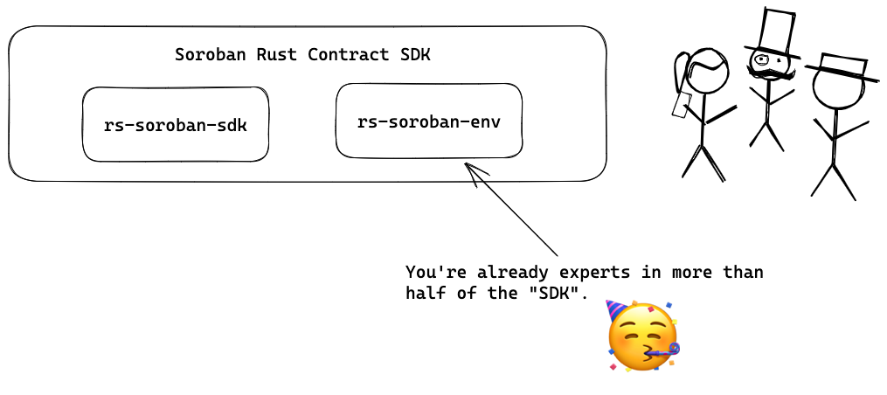
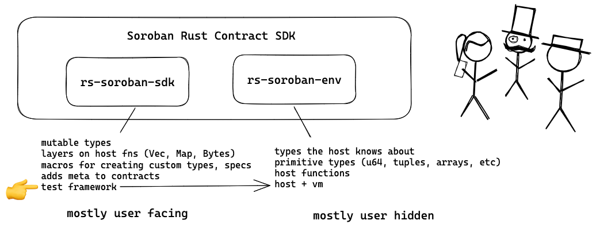
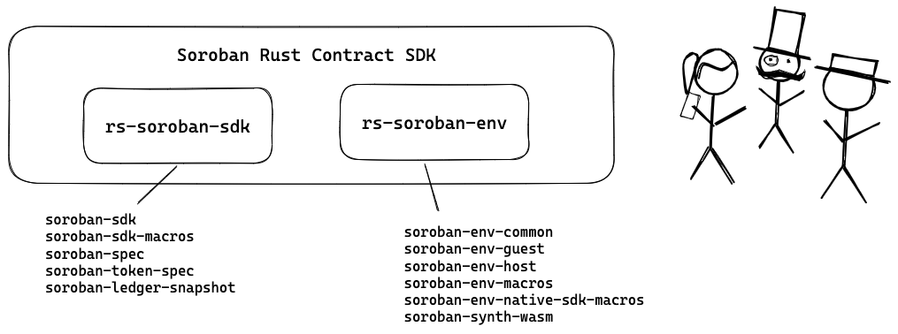
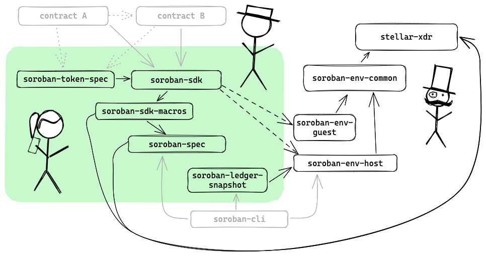
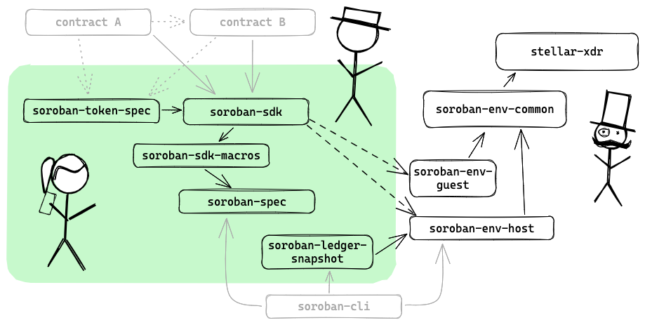
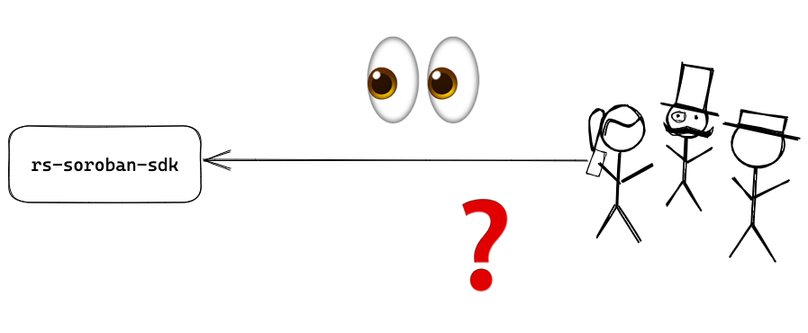

<!--
backgroundImage: "linear-gradient(to bottom, #67b8e3, #0288d1)"
_color: white
-->

# rs-soroban-sdk

---

<!--
backgroundImage:
_backgroundColor: white
-->

## where is the code

---

## what is in the code

---

## crates

---

## crates

---

## crates

---

## motivations

- as much as possible plain rust experience

- hide the WASABI funky type system

- make the WASABI host functions safe/typed

- great unit + integration + fuzz testing story

- lightweight

---

## future possibilities

- blockchain specific features (e.g. fixed point math)

- stdlib-like features

- ?

---

## todo

[github.com/stellar/rs-soroban-sdk/issues](https://github.com/stellar/rs-soroban-sdk/issues) ~40 open

---

## todo straightforward

- tidy up / minor API improvements

- rewrites to stay up-to-date with env

---

## todo requiring some thought

- gaps in macro generation and error handling

- rewrite inefficient impls (e.g. vec, map iteration)

- better built-in `contractimport!` experience

- fuzzing ([@brson](https://github.com/brson) is on this)

---

## code walkthrough

- a look at what code the sdk generates for a basic contract
- a walk through the some of the sdk itself:
    - lib.rs
    - env.rs
    - vec.rs
    - bytes.rs
    - testutils

---

## q&a

---

## next

